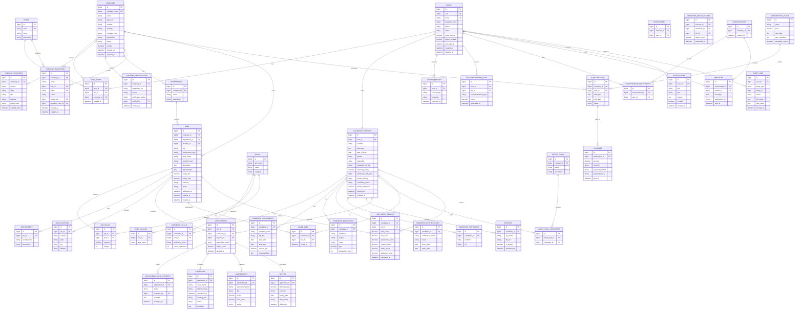

```mermaid
erDiagram

    USERS {
        bigint id PK
        string uuid UK
        string email UK
        string password_hash
        string phone
        string status
        boolean email_verified
        boolean phone_verified
        datetime last_login_at
        datetime created_at
        datetime updated_at
    }

    ROLES {
        bigint id PK
        string code UK
        string name
        string description
    }

    USER_ROLES {
        bigint id PK
        bigint user_id FK
        bigint role_id FK
        bigint company_id FK
        datetime created_at
    }

    COMPANIES {
        bigint id PK
        string company_code UK
        string name
        string logo_url
        string website
        string industry
        string company_size
        string description
        string status
        boolean verified
        datetime created_at
        datetime updated_at
    }

    COMPANY_LOCATIONS {
        bigint id PK
        bigint company_id FK
        string country
        string state
        string city
        string address
        string postal_code
        boolean is_head_office
    }

    COMPANY_VERIFICATIONS {
        bigint id PK
        bigint company_id FK
        string registration_no
        string tax_no
        string verification_status
        bigint verified_by FK
        datetime verified_at
    }

    DEPARTMENTS {
        bigint id PK
        bigint company_id FK
        string name
        string description
    }

    COMPANY_INVITATIONS {
        bigint id PK
        bigint company_id FK
        string email
        bigint role_id FK
        string token UK
        string status
        bigint invited_by FK
        bigint accepted_user_id FK
        datetime expires_at
        datetime created_at
    }

    CANDIDATE_PROFILES {
        bigint id PK
        bigint user_id FK
        string headline
        text summary
        date date_of_birth
        string gender
        string nationality
        string preferred_job_title
        decimal expected_salary
        string preferred_work_type
        string profile_visibility
        string availability_status
        decimal profile_completion
        datetime created_at
        datetime updated_at
    }

    SKILLS {
        bigint id PK
        string skill_code
        string name
        string category
    }

    SKILL_ALIASES {
        bigint id PK
        bigint skill_id FK
        string alias_name
    }

    CANDIDATE_SKILLS {
        bigint id PK
        bigint candidate_id FK
        bigint skill_id FK
        string proficiency_level
        int years_experience
    }

    CANDIDATE_EXPERIENCES {
        bigint id PK
        bigint candidate_id FK
        string company_name
        string job_title
        date start_date
        date end_date
        boolean current_job
        text responsibilities
    }

    CANDIDATE_EDUCATIONS {
        bigint id PK
        bigint candidate_id FK
        string institution
        string degree
        string major
        decimal gpa
        int graduation_year
    }

    CANDIDATE_CERTIFICATIONS {
        bigint id PK
        bigint candidate_id FK
        string certification_name
        string issuer
        date issue_date
        date expiry_date
    }

    CANDIDATE_PORTFOLIOS {
        bigint id PK
        bigint candidate_id FK
        string platform
        string url
    }

    RESUMES {
        bigint id PK
        bigint candidate_id FK
        string file_name
        string file_url
        boolean is_default
        datetime uploaded_at
    }

    JOBS {
        bigint id PK
        bigint company_id FK
        bigint department_id FK
        bigint recruiter_id FK
        string title
        string employment_type
        string work_mode
        string seniority_level
        text description
        text requirements
        decimal salary_min
        decimal salary_max
        string currency
        string status
        datetime published_at
        datetime expired_at
        datetime created_at
    }

    JOB_SKILLS {
        bigint id PK
        bigint job_id FK
        bigint skill_id FK
        boolean required
        int weight
    }

    JOB_BENEFITS {
        bigint id PK
        bigint job_id FK
        string benefit_name
        string description
    }

    JOB_LOCATIONS {
        bigint id PK
        bigint job_id FK
        string country
        string state
        string city
        string address
    }

    APPLICATIONS {
        bigint id PK
        bigint job_id FK
        bigint candidate_id FK
        bigint resume_id FK
        string application_status
        decimal match_score
        datetime applied_at
    }

    APPLICATION_STATUS_HISTORY {
        bigint id PK
        bigint application_id FK
        string status
        bigint changed_by FK
        text remarks
        datetime changed_at
    }

    INTERVIEWS {
        bigint id PK
        bigint application_id FK
        string round_name
        string interview_type
        datetime scheduled_at
        string meeting_link
        string status
        text feedback
    }

    INTERVIEWERS {
        bigint id PK
        bigint interview_id FK
        bigint user_id FK
    }

    ASSESSMENTS {
        bigint id PK
        bigint application_id FK
        string assessment_type
        string title
        decimal score
        decimal max_score
        string status
    }

    OFFERS {
        bigint id PK
        bigint application_id FK
        decimal offered_salary
        string currency
        date joining_date
        string offer_status
        datetime offered_at
    }

    TALENT_POOLS {
        bigint id PK
        bigint company_id FK
        string name
        string description
    }

    TALENT_POOL_CANDIDATES {
        bigint id PK
        bigint talent_pool_id FK
        bigint candidate_id FK
    }

    SAVED_JOBS {
        bigint id PK
        bigint candidate_id FK
        bigint job_id FK
        datetime saved_at
    }

    JOB_MATCH_SCORES {
        bigint id PK
        bigint candidate_id FK
        bigint job_id FK
        decimal total_score
        decimal skill_score
        decimal experience_score
        decimal location_score
        decimal salary_score
        decimal education_score
        datetime calculated_at
    }

    CANDIDATE_MATCH_SCORES {
        bigint id PK
        bigint recruiter_id FK
        bigint candidate_id FK
        bigint job_id FK
        decimal match_score
        datetime calculated_at
    }

    SEARCH_HISTORY {
        bigint id PK
        bigint user_id FK
        string search_type
        string keywords
        datetime searched_at
    }

    RECOMMENDATION_LOGS {
        bigint id PK
        bigint user_id FK
        bigint job_id FK
        string recommendation_type
        decimal score
        datetime generated_at
    }

    CONVERSATIONS {
        bigint id PK
        bigint company_id FK
        datetime created_at
    }

    CONVERSATION_PARTICIPANTS {
        bigint id PK
        bigint conversation_id FK
        bigint user_id FK
    }

    MESSAGES {
        bigint id PK
        bigint conversation_id FK
        bigint sender_id FK
        text message
        string attachment_url
        datetime sent_at
    }

    NOTIFICATIONS {
        bigint id PK
        bigint user_id FK
        string title
        string type
        text content
        boolean is_read
        datetime created_at
    }

    SUBSCRIPTION_PLANS {
        bigint id PK
        string name
        decimal price
        int max_jobs
        int max_recruiters
        boolean candidate_search
    }

    SUBSCRIPTIONS {
        bigint id PK
        bigint company_id FK
        bigint plan_id FK
        date start_date
        date end_date
        string status
    }

    PAYMENTS {
        bigint id PK
        bigint subscription_id FK
        decimal amount
        string currency
        string payment_method
        string payment_status
        datetime paid_at
    }

    AUDIT_LOGS {
        bigint id PK
        bigint user_id FK
        string entity_type
        bigint entity_id
        string action
        json old_value
        json new_value
        datetime created_at
    }

    USERS ||--o{ USER_ROLES : has
    ROLES ||--o{ USER_ROLES : assigned

    COMPANIES ||--o{ USER_ROLES : contains
    COMPANIES ||--o{ COMPANY_LOCATIONS : owns
    COMPANIES ||--o{ COMPANY_VERIFICATIONS : verified
    COMPANIES ||--o{ DEPARTMENTS : has
    COMPANIES ||--o{ COMPANY_INVITATIONS : invites
    ROLES ||--o{ COMPANY_INVITATIONS : "invited as"

    USERS ||--|| CANDIDATE_PROFILES : owns

    CANDIDATE_PROFILES ||--o{ CANDIDATE_SKILLS : has
    SKILLS ||--o{ CANDIDATE_SKILLS : assigned

    SKILLS ||--o{ SKILL_ALIASES : has

    CANDIDATE_PROFILES ||--o{ CANDIDATE_EXPERIENCES : has
    CANDIDATE_PROFILES ||--o{ CANDIDATE_EDUCATIONS : has
    CANDIDATE_PROFILES ||--o{ CANDIDATE_CERTIFICATIONS : has
    CANDIDATE_PROFILES ||--o{ CANDIDATE_PORTFOLIOS : has
    CANDIDATE_PROFILES ||--o{ RESUMES : uploads

    COMPANIES ||--o{ JOBS : posts
    DEPARTMENTS ||--o{ JOBS : contains

    JOBS ||--o{ JOB_SKILLS : requires
    SKILLS ||--o{ JOB_SKILLS : mapped

    JOBS ||--o{ JOB_BENEFITS : offers
    JOBS ||--o{ JOB_LOCATIONS : located

    JOBS ||--o{ APPLICATIONS : receives
    CANDIDATE_PROFILES ||--o{ APPLICATIONS : submits

    APPLICATIONS ||--o{ APPLICATION_STATUS_HISTORY : tracks
    APPLICATIONS ||--o{ INTERVIEWS : schedules
    APPLICATIONS ||--o{ ASSESSMENTS : evaluates
    APPLICATIONS ||--|| OFFERS : generates

    TALENT_POOLS ||--o{ TALENT_POOL_CANDIDATES : contains
    CANDIDATE_PROFILES ||--o{ TALENT_POOL_CANDIDATES : added

    CANDIDATE_PROFILES ||--o{ SAVED_JOBS : saves
    JOBS ||--o{ SAVED_JOBS : bookmarked

    CANDIDATE_PROFILES ||--o{ JOB_MATCH_SCORES : scored
    JOBS ||--o{ JOB_MATCH_SCORES : matched

    USERS ||--o{ SEARCH_HISTORY : performs
    USERS ||--o{ RECOMMENDATION_LOGS : receives

    CONVERSATIONS ||--o{ CONVERSATION_PARTICIPANTS : contains
    USERS ||--o{ CONVERSATION_PARTICIPANTS : joins

    CONVERSATIONS ||--o{ MESSAGES : contains
    USERS ||--o{ MESSAGES : sends

    USERS ||--o{ NOTIFICATIONS : receives

    SUBSCRIPTION_PLANS ||--o{ SUBSCRIPTIONS : defines
    COMPANIES ||--o{ SUBSCRIPTIONS : subscribes

    SUBSCRIPTIONS ||--o{ PAYMENTS : paid_by

    USERS ||--o{ AUDIT_LOGS : performs
```